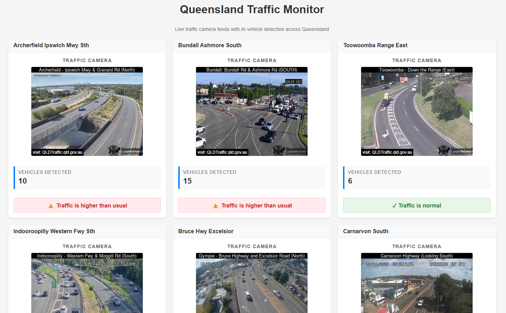
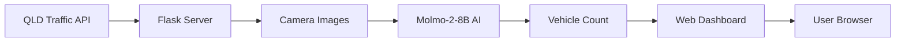

# Queensland Traffic Monitor

A real-time traffic monitoring dashboard that uses AI to detect and count vehicles from Queensland traffic cameras.



## Features

- **Live Traffic Camera Feeds**: Displays up to 12 traffic cameras from across Queensland
- **AI-Powered Vehicle Detection**: Uses the Molmo-2-8B vision model via OpenRouter to count vehicles in real-time
- **Traffic Status Indicators**: Visual alerts when traffic is higher than normal
- **Auto-Refresh Dashboard**: Updates every 60 seconds automatically
- **Responsive Grid Layout**: Adapts to different screen sizes
- **Smart Caching**: Protects API rate limits with intelligent caching

## How It Works



1. The application fetches live camera feeds from the Queensland Traffic API
2. Each camera image is analyzed by the Molmo-2-8B vision model
3. Vehicle counts are compared against average thresholds
4. The dashboard displays real-time traffic status for each location

## Tech Stack

- **Backend**: Python Flask
- **AI Model**: [Molmo-2-8B](https://huggingface.co/allenai/Molmo-2-8B) via OpenRouter API
- **Computer Vision**: OpenCV, PIL
- **Data Processing**: NumPy
- **Frontend**: HTML/CSS with Jinja2 templates

## Installation

### Prerequisites

- Python 3.8 or higher
- An OpenRouter API key ([Get one here](https://openrouter.ai/))

### Setup

1. Clone the repository:
   ```bash
   git clone https://github.com/yourusername/traffic_monitor.git
   cd traffic_monitor
   ```

2. Create a virtual environment:
   ```bash
   python -m venv trafficenv
   
   # Windows
   trafficenv\Scripts\activate
   
   # Linux/macOS
   source trafficenv/bin/activate
   ```

3. Install dependencies:
   ```bash
   pip install flask openai requests numpy Pillow opencv-python
   ```

4. Create an API key file:
   Create a file named `apikey.py` in the project root:
   ```python
   api_key = "your-openrouter-api-key-here"
   ```

5. Run the application:
   ```bash
   python traffic.py
   ```

6. Open your browser and navigate to:
   ```
   http://localhost:5000
   ```

## Configuration

### Environment Variables

| Variable | Description | Default |
|----------|-------------|---------|
| `AVERAGE_VEHICLES` | Baseline vehicle count for traffic comparison | 5 |

### API Keys Required

- **OpenRouter API Key**: Required for Molmo-2-8B vehicle detection
- **QLD Traffic API**: Uses a public API key (included)

## Project Structure

```
traffic_monitor/
├── traffic.py              # Main Flask application
├── apikey.py               # API key configuration (gitignored)
├── cameras.json            # Camera data cache
├── templates/
│   └── index.html          # Dashboard template
├── Traffic_Monitor_Screenshot.png
├── .gitignore
└── README.md
```

## API Reference

### Endpoints

| Endpoint | Method | Description |
|----------|--------|-------------|
| `/` | GET | Main dashboard with all cameras |

### External APIs Used

- [QLD Traffic API](https://www.data.qld.gov.au/dataset/traffic-camera-webcam-feeds) - Live traffic camera feeds
- [OpenRouter API](https://openrouter.ai/) - AI model inference

## Customization

### Adding More Cameras

Modify the camera limit in [`traffic.py`](traffic.py:94):
```python
params={
    "apikey": "your-api-key",
    "limit": 20  # Change this number
}
```

### Adjusting Traffic Threshold

Modify `AVERAGE_VEHICLES` in [`traffic.py`](traffic.py:78):
```python
AVERAGE_VEHICLES = 5  # Adjust based on your location
```

## Known Limitations

- Free tier OpenRouter API has rate limits
- Vehicle detection accuracy depends on image quality and camera angle
- Cache duration is set to 60 seconds to conserve API calls

## Contributing

1. Fork the repository
2. Create a feature branch (`git checkout -b feature/amazing-feature`)
3. Commit your changes (`git commit -m 'Add amazing feature'`)
4. Push to the branch (`git push origin feature/amazing-feature`)
5. Open a Pull Request

## License

This project is open source and available under the [MIT License](LICENSE).

## Acknowledgments

- [Allen AI](https://allenai.org/) for the Molmo vision model
- [Queensland Government](https://www.qld.gov.au/) for the public traffic camera API
- [OpenRouter](https://openrouter.ai/) for AI model hosting
